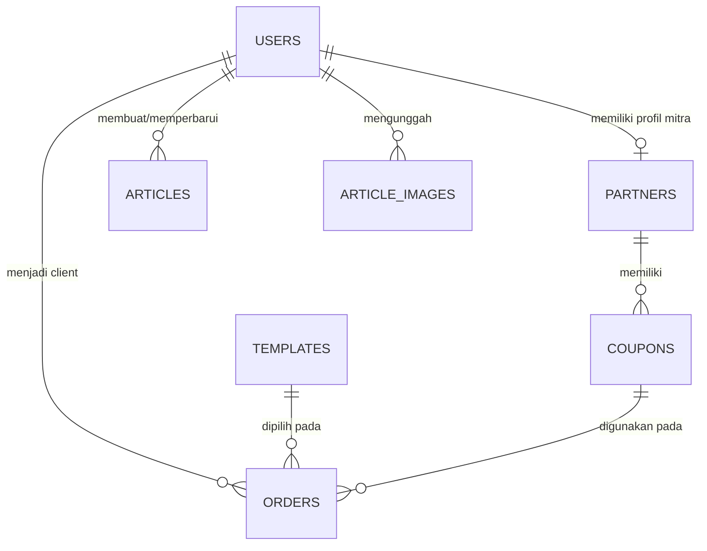

# Schema Database Bidtech

Dokumen ini adalah sumber kebenaran schema database `dashboard-bidtech`. Isinya mengikuti migration final di `database/migrations`, bukan riwayat perubahan schema lama.

## Kebijakan migration

- Schema aplikasi memakai satu migration `create_*_table.php` per tabel dengan bentuk tabel final.
- Perubahan schema selama fase rekonstruksi dilakukan pada migration tabel terkait, lalu diterapkan dengan `php artisan migrate:fresh --seed`.
- Alur ini bersifat destruktif dan hanya sesuai untuk reset terkontrol. Jangan menjalankan `migrate:fresh` pada database yang datanya harus dipertahankan tanpa backup dan rencana migrasi data.
- Dua migration bawaan Laravel tetap dipertahankan: cache dan queue/jobs.
- `created_at` dan `updated_at` yang ditulis sebagai `timestamps` adalah kolom timestamp nullable bawaan Laravel.
- Seluruh nominal uang disimpan sebagai bilangan bulat unsigned dalam rupiah; tidak ada pecahan desimal.
- Nilai enum disimpan sebagai `VARCHAR` dan di-cast ke PHP enum oleh model. Database tidak memiliki `CHECK constraint` untuk nilai enum tersebut.

## Daftar migration dan tabel

| Urutan | Migration | Tabel yang dibuat |
| --- | --- | --- |
| 1 | `0001_01_01_000001_create_cache_table.php` | `cache`, `cache_locks` |
| 2 | `0001_01_01_000002_create_jobs_table.php` | `jobs`, `job_batches`, `failed_jobs` |
| 3 | `2026_10_02_000001_create_password_reset_tokens_table.php` | `password_reset_tokens` |
| 4 | `2026_10_02_000002_create_sessions_table.php` | `sessions` |
| 5 | `2026_10_02_000003_create_users_table.php` | `users` |
| 6 | `2026_10_02_000004_create_partners_table.php` | `partners` |
| 7 | `2026_10_02_000005_create_templates_table.php` | `templates` |
| 8 | `2026_10_02_000006_create_coupons_table.php` | `coupons` |
| 9 | `2026_10_02_000007_create_orders_table.php` | `orders` |
| 10 | `2026_10_02_000008_create_articles_table.php` | `articles` |
| 11 | `2026_10_02_000009_create_article_images_table.php` | `article_images` |

Laravel juga membuat tabel internal `migrations` ketika repository migration pertama kali diinisialisasi. Tabel ini dikelola framework dan tidak mempunyai file migration aplikasi.

## Relasi utama

Relasi tidak langsung untuk laporan komisi adalah `partners -> coupons -> orders`. Nilai identitas mitra dan nominal komisi tetap disalin ke order sebagai snapshot agar histori transaksi tidak berubah ketika profil atau aturan komisi diperbarui.

## Nilai enum dan aturan aplikasi

| Konteks | Nilai yang diizinkan aplikasi | Sumber |
| --- | --- | --- |
| `users.role` | `ADMIN`, `MEDIA`, `MARKETING`, `KLIEN`, `MITRA` | `App\Enums\Role` |
| `partners.type_commission` | `PERCENTAGE`, `FIXED` | `App\Enums\CommissionType` |
| `coupons.*_discount_type` | `PERCENTAGE`, `FIXED`, `NOMINAL`, atau `NULL` | `App\Enums\DiscountType` |
| `orders.status` | `unpaid`, `paid`, `invalid` | `App\Enums\OrderStatus` |
| `orders.domain_status` | `pending_registration`, `registered` | `App\Enums\DomainStatus` |
| `orders.website_status` | `in_progress`, `deployed`, `maintenance` | `App\Enums\WebsiteStatus` |
| `articles.status` | `draft`, `terbit`, `nonaktif` | `App\Enums\ArticleStatus` |
| `article_images.status` | `pending`, `ready` | `App\Enums\ArticleImageStatus` |

Aturan berikut ditegakkan di layer aplikasi, bukan oleh constraint database:

- `users.email` adalah email login dashboard internal dan harus berakhiran `@bidtech.co.id`; email kontak asli pelanggan disimpan pada `orders.email`.
- `users.whatsapp` wajib untuk role selain `KLIEN`; klien boleh `NULL` karena kontak transaksi ada pada order.
- Baris `partners` hanya boleh dimiliki user dengan role `MITRA`.
- `users.author_name` dipakai sebagai byline role `MEDIA`; jika kosong, aplikasi memakai `users.name`.
- `users.photo` menyimpan path relatif pada object storage S3-compatible (prefix `profiles/`) atau URL absolut; `User::photo_url` resolve ke URL penuh dan fallback ke `profiles/placeholder_profile.webp` bila kosong.
- `coupons.*_discount_max` hanya bermakna sebagai batas nominal untuk diskon `PERCENTAGE`.
- Kombinasi field diskon kupon harus divalidasi aplikasi karena database mengizinkan type, amount, atau max bernilai `NULL` secara independen.

## Tabel aplikasi

### `users`

Identitas tunggal seluruh pengguna dashboard. Status domain dan website sengaja tidak disimpan di sini karena satu klien dapat mempunyai lebih dari satu order.

| Kolom | Tipe | Null/default | Key/index | Keterangan |
| --- | --- | --- | --- | --- |
| `id` | `BIGINT UNSIGNED` | tidak null, auto-increment | PK | ID user |
| `role` | `VARCHAR(20)` | tidak null | index | Role aplikasi |
| `name` | `VARCHAR(150)` | tidak null | - | Nama akun |
| `email` | `VARCHAR(150)` | tidak null | unique | Email login internal |
| `whatsapp` | `VARCHAR(30)` | nullable | - | Nomor kontak akun |
| `password` | `VARCHAR(255)` | tidak null | - | Hash password |
| `photo` | `VARCHAR(255)` | nullable, default `profiles/placeholder_profile.webp` | - | Path/URL foto generik |
| `author_name` | `VARCHAR(150)` | nullable | - | Nama byline media |
| `remember_token` | `VARCHAR(100)` | nullable | - | Token remember-me Laravel |
| `created_at` | `TIMESTAMP` | nullable | - | Waktu dibuat |
| `updated_at` | `TIMESTAMP` | nullable | - | Waktu diperbarui |

Relasi model:

- `User::orders()` -> banyak `orders` melalui `orders.client_id`.
- `User::partner()` -> maksimal satu `partners` melalui unique `partners.user_id`.

### `partners`

Profil ekstensi untuk user role `MITRA`.

| Kolom | Tipe | Null/default | Key/index | Keterangan |
| --- | --- | --- | --- | --- |
| `id` | `BIGINT UNSIGNED` | tidak null, auto-increment | PK | ID partner |
| `user_id` | `BIGINT UNSIGNED` | tidak null | unique, FK | Pemilik profil partner |
| `type_commission` | `VARCHAR(20)` | tidak null | - | Tipe komisi |
| `amount_commission` | `BIGINT UNSIGNED` | tidak null | - | Persentase atau nominal sesuai tipe |
| `created_at` | `TIMESTAMP` | nullable | - | Waktu dibuat |
| `updated_at` | `TIMESTAMP` | nullable | - | Waktu diperbarui |

Foreign key: `user_id -> users.id` dengan `ON DELETE RESTRICT`.

### `templates`

Katalog template website dan harga paket saat ini. `id` adalah key internal auto-increment; `slug` adalah identity stabil untuk sinkronisasi katalog dan fallback URL demo.

| Kolom | Tipe | Null/default | Key/index | Keterangan |
| --- | --- | --- | --- | --- |
| `id` | `BIGINT UNSIGNED` | tidak null, auto-increment | PK | ID template |
| `slug` | `VARCHAR(255)` | tidak null | unique | Key stabil katalog |
| `name` | `VARCHAR(150)` | tidak null | - | Nama template |
| `category` | `VARCHAR(100)` | tidak null | - | Kategori template |
| `price` | `BIGINT UNSIGNED` | tidak null | - | Harga total/fallback katalog |
| `template_price` | `BIGINT UNSIGNED` | default `0` | - | Harga komponen template |
| `server_price` | `BIGINT UNSIGNED` | default `0` | - | Harga komponen server |
| `service_price` | `BIGINT UNSIGNED` | default `0` | - | Harga komponen layanan |
| `template_desc` | `VARCHAR(255)` | nullable | - | Deskripsi komponen template |
| `server_desc` | `VARCHAR(255)` | nullable | - | Deskripsi komponen server |
| `service_desc` | `VARCHAR(255)` | nullable | - | Deskripsi komponen layanan |
| `preview` | `VARCHAR(255)` | nullable | - | Path/URL gambar preview |
| `views` | `BIGINT UNSIGNED` | default `0` | - | Counter tampilan |
| `demo_url` | `VARCHAR(255)` | nullable | - | URL/path demo eksplisit |
| `description` | `TEXT` | nullable | - | Deskripsi template |
| `tags` | `VARCHAR(255)` | nullable | - | Daftar tag dipisahkan koma |
| `is_active` | `BOOLEAN` | default `true` | - | Visibilitas template |
| `created_at` | `TIMESTAMP` | nullable | - | Waktu dibuat |
| `updated_at` | `TIMESTAMP` | nullable | - | Waktu diperbarui |

Harga pada template dapat berubah. Order selalu menyimpan snapshot harga dan deskripsi agar invoice lama tidak ikut berubah.

### `coupons`

Kupon umum atau kupon milik partner. Satu kupon dapat mengatur diskon yang berbeda untuk subtotal dan empat komponen harga.

| Kolom | Tipe | Null/default | Key/index | Keterangan |
| --- | --- | --- | --- | --- |
| `id` | `BIGINT UNSIGNED` | tidak null, auto-increment | PK | ID kupon |
| `name` | `VARCHAR(150)` | tidak null | - | Nama kupon |
| `code` | `VARCHAR(50)` | tidak null | unique | Kode redeem |
| `valid_from` | `TIMESTAMP` | nullable | - | Awal masa berlaku |
| `valid_until` | `TIMESTAMP` | nullable | - | Akhir masa berlaku |
| `usage_limit` | `INT UNSIGNED` | nullable | - | Kuota global; `NULL` berarti tanpa batas |
| `user_usage_limit` | `INT UNSIGNED` | nullable, default `1` | - | Kuota per email; `NULL` berarti tanpa batas |
| `min_order_amount` | `BIGINT UNSIGNED` | nullable | - | Minimum subtotal sebelum diskon |
| `subtotal_discount_type` | `VARCHAR(20)` | nullable | - | Tipe diskon subtotal |
| `subtotal_discount_amount` | `BIGINT UNSIGNED` | nullable | - | Nilai diskon subtotal |
| `subtotal_discount_max` | `BIGINT UNSIGNED` | nullable | - | Cap nominal persentase subtotal |
| `service_discount_type` | `VARCHAR(20)` | nullable | - | Tipe diskon layanan |
| `service_discount_amount` | `BIGINT UNSIGNED` | nullable | - | Nilai diskon layanan |
| `service_discount_max` | `BIGINT UNSIGNED` | nullable | - | Cap nominal persentase layanan |
| `template_discount_type` | `VARCHAR(20)` | nullable | - | Tipe diskon template |
| `template_discount_amount` | `BIGINT UNSIGNED` | nullable | - | Nilai diskon template |
| `template_discount_max` | `BIGINT UNSIGNED` | nullable | - | Cap nominal persentase template |
| `server_discount_type` | `VARCHAR(20)` | nullable | - | Tipe diskon server |
| `server_discount_amount` | `BIGINT UNSIGNED` | nullable | - | Nilai diskon server |
| `server_discount_max` | `BIGINT UNSIGNED` | nullable | - | Cap nominal persentase server |
| `domain_discount_type` | `VARCHAR(20)` | nullable | - | Tipe diskon domain |
| `domain_discount_amount` | `BIGINT UNSIGNED` | nullable | - | Nilai diskon domain |
| `domain_discount_max` | `BIGINT UNSIGNED` | nullable | - | Cap nominal persentase domain |
| `partner_id` | `BIGINT UNSIGNED` | nullable | FK | Pemilik kupon; `NULL` untuk kupon umum |
| `is_active` | `BOOLEAN` | default `true` | index | Status aktif administratif |
| `created_at` | `TIMESTAMP` | nullable | - | Waktu dibuat |
| `updated_at` | `TIMESTAMP` | nullable | - | Waktu diperbarui |

Foreign key: `partner_id -> partners.id` dengan `ON DELETE SET NULL`.

Semantik per tipe diskon:

- `PERCENTAGE`: `amount` adalah persen; hasil dapat dibatasi `max` dan tidak boleh melebihi harga komponen.
- `FIXED`: harga akhir komponen di-set ke `amount`; diskon adalah selisih harga awal dan harga tetap, minimum nol.
- `NOMINAL`: `amount` adalah potongan rupiah langsung dan tidak boleh melebihi harga komponen.
- Type `NULL`: komponen tersebut tidak mendapat diskon.

Kuota tidak memakai tabel usage terpisah. Pemakaian diturunkan dari order yang memiliki `coupon_id`; batas per pengguna dihitung menggunakan `orders.email`.

### `orders`

Transaksi checkout sekaligus unit proyek/website. Tabel ini menyimpan foreign key ke master data dan snapshot yang diperlukan untuk menjaga histori invoice.

| Kolom | Tipe | Null/default | Key/index | Keterangan |
| --- | --- | --- | --- | --- |
| `id` | `BIGINT UNSIGNED` | tidak null, auto-increment | PK | ID order |
| `order_number` | `VARCHAR(50)` | tidak null | unique | Nomor order publik |
| `template_id` | `BIGINT UNSIGNED` | tidak null | FK | Template yang dibeli |
| `client_id` | `BIGINT UNSIGNED` | nullable | FK | Akun dashboard klien setelah pembayaran |
| `domain_name` | `VARCHAR(255)` | tidak null | index | Domain yang diminta |
| `domain_price` | `BIGINT UNSIGNED` | tidak null | - | Snapshot harga domain |
| `domain_duration` | `INT UNSIGNED` | default `1` | - | Durasi domain dalam tahun |
| `domain_price_per_year` | `BIGINT UNSIGNED` | nullable | - | Snapshot harga domain per tahun |
| `template_price` | `BIGINT UNSIGNED` | nullable | - | Snapshot harga template |
| `template_desc` | `VARCHAR(255)` | nullable | - | Snapshot deskripsi template |
| `server_price` | `BIGINT UNSIGNED` | nullable | - | Snapshot harga server |
| `server_desc` | `VARCHAR(255)` | nullable | - | Snapshot deskripsi server |
| `service_price` | `BIGINT UNSIGNED` | nullable | - | Snapshot harga layanan |
| `service_desc` | `VARCHAR(255)` | nullable | - | Snapshot deskripsi layanan |
| `coupon_id` | `BIGINT UNSIGNED` | nullable | FK | Kupon sumber diskon |
| `coupon_code` | `VARCHAR(50)` | nullable | - | Snapshot kode kupon |
| `discount_amount` | `BIGINT UNSIGNED` | default `0` | - | Snapshot total diskon |
| `is_partner_order` | `BOOLEAN` | default `false` | index | Penanda order berasal dari kupon partner |
| `partner_name` | `VARCHAR(150)` | nullable | - | Snapshot nama partner |
| `partner_commission_amount` | `BIGINT UNSIGNED` | default `0` | - | Snapshot nominal komisi |
| `commission_paid_out_at` | `TIMESTAMP` | nullable | - | Waktu komisi dicairkan |
| `domain_status` | `VARCHAR(30)` | default `pending_registration` | - | Status registrasi domain |
| `domain_final` | `VARCHAR(255)` | nullable | - | Domain final hasil provisioning |
| `website_status` | `VARCHAR(30)` | default `in_progress` | - | Status pengerjaan website |
| `full_name` | `VARCHAR(150)` | tidak null | - | Nama kontak asli pelanggan |
| `email` | `VARCHAR(150)` | tidak null | index | Email kontak/invoice pelanggan |
| `whatsapp` | `VARCHAR(30)` | tidak null | - | WhatsApp kontak pelanggan |
| `xendit_invoice_id` | `VARCHAR(255)` | nullable | unique | ID invoice Xendit |
| `xendit_payment_url` | `TEXT` | nullable | - | URL pembayaran Xendit |
| `status` | `VARCHAR(30)` | default `unpaid` | index | Status pembayaran |
| `payment_expires_at` | `TIMESTAMP` | nullable | - | Batas pembayaran |
| `paid_at` | `TIMESTAMP` | nullable | - | Waktu pembayaran terkonfirmasi |
| `paid_email_sent_at` | `TIMESTAMP` | nullable | - | Waktu email lunas berhasil dikirim |
| `created_at` | `TIMESTAMP` | nullable | - | Waktu dibuat |
| `updated_at` | `TIMESTAMP` | nullable | - | Waktu diperbarui |

Foreign key dan aksi penghapusan:

- `template_id -> templates.id` dengan `ON DELETE RESTRICT`.
- `client_id -> users.id` dengan `ON DELETE SET NULL`.
- `coupon_id -> coupons.id` dengan `ON DELETE SET NULL`.

Lifecycle penting:

- Saat checkout guest dibuat, `client_id` masih `NULL`.
- Setelah pembayaran sukses dan akun dashboard dibuat/disinkronkan, order dihubungkan melalui `client_id`.
- Data harga, kupon, nama partner, dan komisi pada order adalah snapshot; jangan dihitung ulang dari master untuk invoice historis.
- Order partner yang sudah lunas menjadi dasar laporan komisi. `commission_paid_out_at IS NULL` berarti belum dicairkan.
- `domain_status`, `domain_final`, dan `website_status` melekat ke proyek/order, bukan identitas user.

### `articles`

Konten artikel BlockNote. Riwayat slug dan activity log tidak disimpan pada tabel terpisah.

| Kolom | Tipe | Null/default | Key/index | Keterangan |
| --- | --- | --- | --- | --- |
| `id` | `BIGINT UNSIGNED` | tidak null, auto-increment | PK | ID artikel |
| `title` | `VARCHAR(255)` | nullable | - | Judul artikel |
| `slug` | `VARCHAR(255)` | nullable | unique | Slug publik |
| `excerpt` | `TEXT` | nullable | - | Ringkasan artikel |
| `content` | `JSON` | tidak null | - | Dokumen BlockNote |
| `cover_image_url` | `VARCHAR(255)` | nullable | - | URL cover |
| `cover_alt_text` | `VARCHAR(255)` | nullable | - | Alt text cover |
| `status` | `VARCHAR(255)` | default `draft` | index | Status publikasi |
| `published_at` | `TIMESTAMP` | nullable | - | Waktu publikasi |
| `content_updated_at` | `TIMESTAMP` | nullable | - | Waktu perubahan isi bermakna |
| `created_by` | `BIGINT UNSIGNED` | nullable | FK | User pembuat |
| `updated_by` | `BIGINT UNSIGNED` | nullable | FK | User pembaru terakhir |
| `created_at` | `TIMESTAMP` | nullable | - | Waktu dibuat |
| `updated_at` | `TIMESTAMP` | nullable | - | Waktu diperbarui |
| `deleted_at` | `TIMESTAMP` | nullable | - | Soft delete |

Foreign key `created_by` dan `updated_by` mengarah ke `users.id`, keduanya dengan `ON DELETE SET NULL` agar artikel tetap tersimpan bila akun pengelola dihapus.

### `article_images`

Metadata unggahan gambar artikel pada object storage S3-compatible. Tabel tidak mempunyai foreign key ke artikel karena gambar dapat diunggah sebelum draft artikel tersimpan.

| Kolom | Tipe | Null/default | Key/index | Keterangan |
| --- | --- | --- | --- | --- |
| `id` | `BIGINT UNSIGNED` | tidak null, auto-increment | PK | ID gambar |
| `uploaded_by` | `BIGINT UNSIGNED` | nullable | FK | User pengunggah |
| `tmp_path` | `VARCHAR(255)` | nullable | - | Path sementara bila digunakan |
| `disk_path` | `VARCHAR(255)` | nullable | - | Object key/path final |
| `original_filename` | `VARCHAR(255)` | nullable | - | Nama file dari pengguna |
| `mime_type` | `VARCHAR(255)` | tidak null | - | MIME type tervalidasi |
| `size` | `BIGINT UNSIGNED` | tidak null | - | Ukuran byte |
| `width` | `INT UNSIGNED` | nullable | - | Lebar piksel |
| `height` | `INT UNSIGNED` | nullable | - | Tinggi piksel |
| `status` | `VARCHAR(255)` | default `pending` | index | Status pemrosesan/storage |
| `created_at` | `TIMESTAMP` | nullable | - | Waktu dibuat |
| `updated_at` | `TIMESTAMP` | nullable | - | Waktu diperbarui |

Foreign key: `uploaded_by -> users.id` dengan `ON DELETE SET NULL`.

## Tabel platform Laravel

### `password_reset_tokens`

| Kolom | Tipe | Null/default | Key/index | Keterangan |
| --- | --- | --- | --- | --- |
| `email` | `VARCHAR(255)` | tidak null | PK | Identitas reset password |
| `token` | `VARCHAR(255)` | tidak null | - | Token reset ter-hash |
| `created_at` | `TIMESTAMP` | nullable | - | Waktu token dibuat |

### `sessions`

| Kolom | Tipe | Null/default | Key/index | Keterangan |
| --- | --- | --- | --- | --- |
| `id` | `VARCHAR(255)` | tidak null | PK | ID session |
| `user_id` | `BIGINT UNSIGNED` | nullable | index | ID user bila sudah login |
| `ip_address` | `VARCHAR(45)` | nullable | - | IPv4/IPv6 |
| `user_agent` | `TEXT` | nullable | - | User agent browser |
| `payload` | `LONGTEXT` | tidak null | - | Payload session |
| `last_activity` | `INT` | tidak null | index | Unix timestamp aktivitas terakhir |

`sessions.user_id` sengaja hanya berupa index tanpa foreign key, mengikuti pola tabel session Laravel dan karena migration session dijalankan sebelum `users`.

### `cache`

| Kolom | Tipe | Null/default | Key/index |
| --- | --- | --- | --- |
| `key` | `VARCHAR(255)` | tidak null | PK |
| `value` | `MEDIUMTEXT` | tidak null | - |
| `expiration` | `BIGINT` | tidak null | index |

### `cache_locks`

| Kolom | Tipe | Null/default | Key/index |
| --- | --- | --- | --- |
| `key` | `VARCHAR(255)` | tidak null | PK |
| `owner` | `VARCHAR(255)` | tidak null | - |
| `expiration` | `BIGINT` | tidak null | index |

### `jobs`

| Kolom | Tipe | Null/default | Key/index |
| --- | --- | --- | --- |
| `id` | `BIGINT UNSIGNED` | tidak null, auto-increment | PK |
| `queue` | `VARCHAR(255)` | tidak null | index |
| `payload` | `LONGTEXT` | tidak null | - |
| `attempts` | `SMALLINT UNSIGNED` | tidak null | - |
| `reserved_at` | `INT UNSIGNED` | nullable | - |
| `available_at` | `INT UNSIGNED` | tidak null | - |
| `created_at` | `INT UNSIGNED` | tidak null | - |

### `job_batches`

| Kolom | Tipe | Null/default | Key/index |
| --- | --- | --- | --- |
| `id` | `VARCHAR(255)` | tidak null | PK |
| `name` | `VARCHAR(255)` | tidak null | - |
| `total_jobs` | `INT` | tidak null | - |
| `pending_jobs` | `INT` | tidak null | - |
| `failed_jobs` | `INT` | tidak null | - |
| `failed_job_ids` | `LONGTEXT` | tidak null | - |
| `options` | `MEDIUMTEXT` | nullable | - |
| `cancelled_at` | `INT` | nullable | - |
| `created_at` | `INT` | tidak null | - |
| `finished_at` | `INT` | nullable | - |

### `failed_jobs`

| Kolom | Tipe | Null/default | Key/index |
| --- | --- | --- | --- |
| `id` | `BIGINT UNSIGNED` | tidak null, auto-increment | PK |
| `uuid` | `VARCHAR(255)` | tidak null | unique |
| `connection` | `VARCHAR(255)` | tidak null | bagian index gabungan |
| `queue` | `VARCHAR(255)` | tidak null | bagian index gabungan |
| `payload` | `LONGTEXT` | tidak null | - |
| `exception` | `LONGTEXT` | tidak null | - |
| `failed_at` | `TIMESTAMP` | default waktu saat insert | bagian index gabungan |

Index gabungan: `(connection, queue, failed_at)`.

### `migrations`

Dibuat otomatis oleh Laravel, bukan oleh migration aplikasi.

| Kolom | Tipe | Null/default | Key/index |
| --- | --- | --- | --- |
| `id` | `INT UNSIGNED` | tidak null, auto-increment | PK |
| `migration` | `VARCHAR(255)` | tidak null | - |
| `batch` | `INT` | tidak null | - |

## Schema legacy yang sudah dihentikan

Tabel berikut tidak boleh dibuat kembali kecuali ada keputusan arsitektur baru:

- `promos`: diganti oleh `coupons`.
- `promo_usages`: pemakaian kupon diturunkan dari `orders.coupon_id` dan `orders.email`.
- `article_slug_histories`: riwayat slug tidak dipersistenkan.
- `article_activity_logs`: activity log artikel tidak dipersistenkan.

Kolom legacy yang tidak lagi menjadi bagian schema:

- Pada `users`: `order_id`, `domain_status`, `domain_final`, `website_status`, `is_admin`, `is_media`, dan `author_photo_path`.
- Pada `orders`: `promo_id` dan `promo_code`; penggantinya adalah `coupon_id` dan `coupon_code`.
- Pada kupon: whitelist `allowed_domains` dan `allowed_emails` tidak dipertahankan.

## Checklist sinkronisasi

Setiap perubahan schema dianggap lengkap hanya jika:

1. migration tabel terkait diperbarui;
2. model, enum, factory, seeder, request validation, dan test terkait ikut disesuaikan;
3. dokumen ini diperbarui;
4. `php artisan migrate:fresh --seed` berhasil; dan
5. test suite yang relevan lulus.
