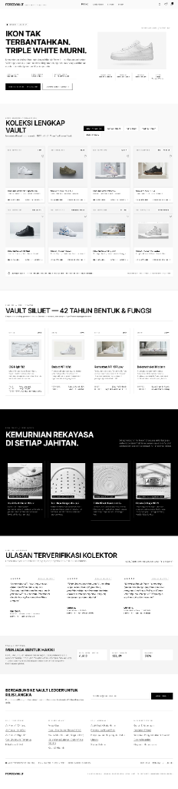

# ForceVault Portfolio Template

Portfolio template eksklusif bergaya arsip (brutalist, premium, dark-mode) yang dirancang khusus untuk memamerkan koleksi sepatu (sneakers) langka, karya fesyen, atau katalog berkelas lainnya.

## 🎨 Features

- ✨ **Premium Animations**: Integrasi GSAP yang memberikan micro-interactions dan efek masuk yang elegan.
- ✨ **Sleek Minimalist Aesthetic**: Desain gelap dan clean dengan tipografi presisi.
- ✨ **Custom Filtering**: Fungsionalitas kategori produk yang responsif.
- ✨ **Scroll-linked Navigation**: Navbar yang bereaksi terhadap aktivitas scroll pengguna.
- ✨ **Fully Responsive**: Teroptimasi untuk desktop dan perangkat seluler (mobile).

## 📸 Preview

| Desktop | Mobile |
|---------|--------|
|  | (To be added) |

## 🛠️ Tech Stack

- **Framework:** Next.js 14+ (App Router)
- **Styling:** Tailwind CSS (dengan Custom Config)
- **Language:** TypeScript
- **Animation:** GSAP (`@gsap/react`)
- **UI Components:** React

## 🚀 Installation

```bash
# 1. Copy template ke project Anda
cp -r bidtech-landing/templates/portfolio/template-2 your-project/

# 2. Install dependencies
cd your-project
npm install

# 3. Run development server
npm run dev

# 4. Open browser
# Navigate to http://localhost:3000
```

## 📝 Customization

- Update colors & design system di `tailwind.config.js`
- Ganti konten di dalam komponen yang berada di folder `components/` (seperti `Header.tsx`, `Footer.tsx`, `Hero.tsx`)
- Edit konten halaman di `app/page.tsx`
- Tambahkan/ganti aset media di dalam folder `public/images/`

## 📂 Folder Structure

```
├── app/              # Pages & routing
├── components/       # React components
├── public/           # Static assets (images, dll)
└── screens/          # Screenshots untuk preview template
```

Lihat [TEMPLATE_STRUCTURE.md](../../TEMPLATE_STRUCTURE.md) untuk detail panduan standar seluruh template di Bidtech.

## 🎯 Best Practices

- Gunakan Tailwind tokens yang sudah diatur (`surface`, `primary`, dll) agar sejalan dengan desain sistem yang ketat.
- Jangan menggunakan `box-shadow` sembarangan untuk mematuhi pedoman desain arsitektur 0 bayangan.
- Pastikan animasi GSAP hanya dipicu jika komponen me-*render* (menggunakan hook `useGSAP`).

## 📄 License

Bidtech Templates - Free to use

---
Last Updated: 2026-09-15
